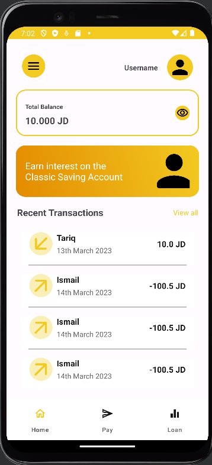
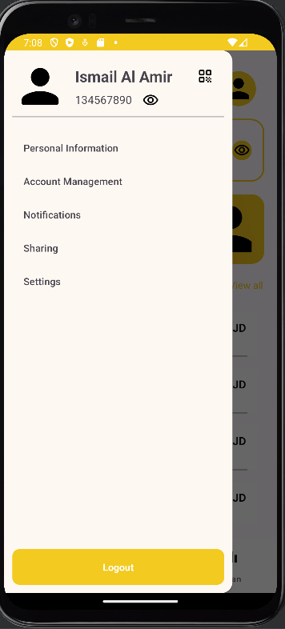
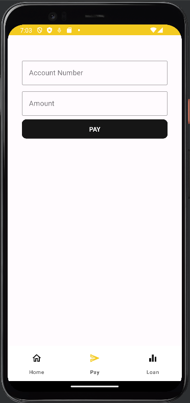
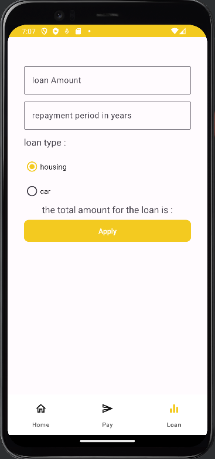
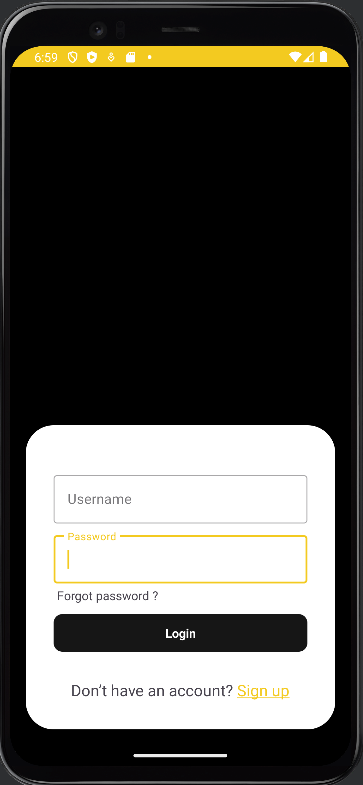
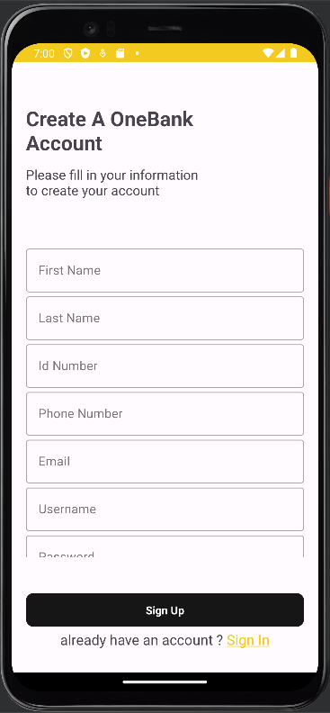

# Bank Android Application Readme

## Author:
- [Ismail Alamir](https://github.com/IsmailAlamir) : developed the android app using Android studio. 
- [Tareq Alzoubi](https://github.com/tareqzoubii) : developed the API using Django [bank Api](https://github.com/tareqzoubii/Bank-System).

- 

## Introduction

Welcome to the Bank Android Application! This application is designed to provide users with a convenient and secure way to manage their finances on the go. The app includes three main features: **Dashboard**, **Pay**, **Loan**, as well as **Login** and **Registration** functionalities. 

## Features

### 1. Dashboard

The Dashboard is the central hub of the Bank Android Application, providing users with an overview of their account information, recent transactions, and other relevant details. Users can easily track their balance, and view recent transactions.

### 2. Pay

The Pay feature allows users to make seamless and secure payments. Users can add payees, transfer funds, and manage recurring payments. The intuitive interface ensures a smooth experience for users looking to send money to friends, family, or pay bills effortlessly.

### 3. Loan

Need financial assistance? The Loan feature enables users to explore loan options, check eligibility, and apply for loans directly from the app. The application streamlines the loan application process, providing users with quick access to the funds they need.

### 4. Login

The Login page provides a secure way for users to access their accounts. Users can enter their credentials to log in and gain access to the app's features.

### 5. Registration

New to the app? The Registration page allows users to create a new account. Simply provide the required information, set up your credentials, and start managing your finances with ease.
